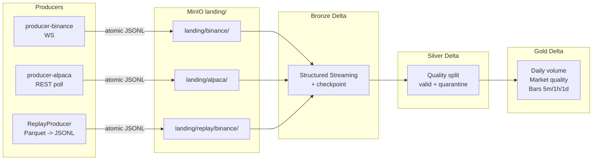
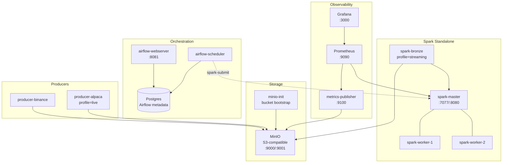
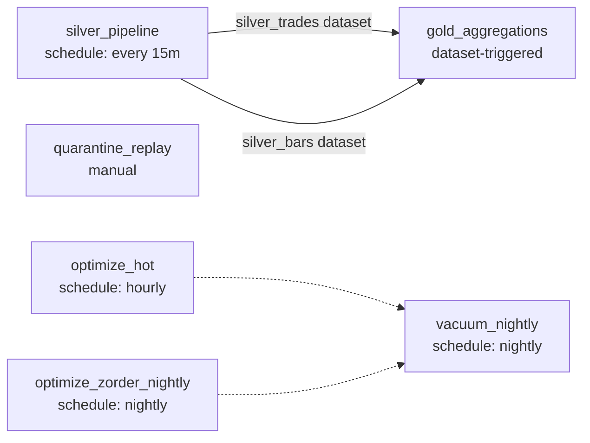

# Architecture Overview

The local MVP uses a medallion lakehouse: producers write atomically rotated JSONL files into
landing storage; Spark Structured Streaming reads them into Bronze Delta with checkpoint
recovery; Silver normalizes records and splits quality failures into quarantine tables; Gold
builds analytical aggregates; Airflow coordinates Silver, Gold, replay, optimization, and
vacuum jobs.

### Data Flow

### Compose Topology

### Airflow Dataset Dependencies

Diagram sources live under `docs/architecture/diagrams/`. See the Evidence Map in `README.md`
for the code paths backing each resume claim.
