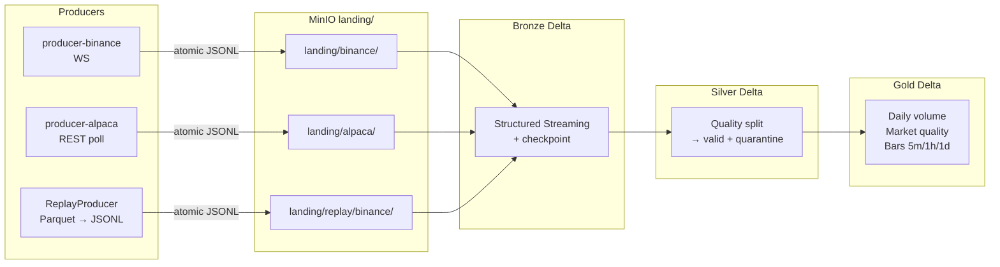
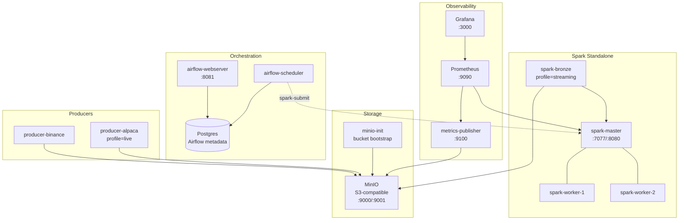
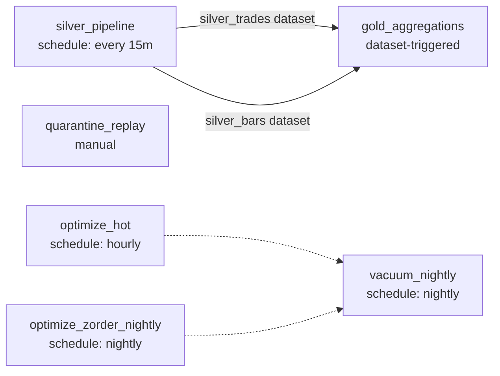

# Plan 1 Closeout Implementation Plan

> **For agentic workers:** REQUIRED SUB-SKILL: Use superpowers:subagent-driven-development (recommended) or superpowers:executing-plans to implement this plan task-by-task. Steps use checkbox (`- [ ]`) syntax for tracking.

**Goal:** Close the five remaining Plan 1 (MVP) gaps so the four committed resume bullets defend themselves under interviewer scrutiny without any external spend, then mark Plan 1 Done.

**Architecture:** Five additive deliverables — three Mermaid architecture diagrams, four hardened GHA workflows yielding green badges, a Slack failure-callback unit test plus captured POST body, a compose-level historical replay end-to-end demo with integration test, and a 4h Binance public-WS soak with timestamped metrics evidence. No pipeline functional code changes.

**Tech Stack:** PySpark 3.5.3, Delta 3.2.0, Airflow 2.10.3, MinIO, Docker Compose, GitHub Actions (Ubuntu runners + Java 17 + uv), Mermaid (rendered inline by GitHub), pytest 8.

---

## Reference Spec

`docs/superpowers/specs/2026-05-03-plan1-closeout-design.md`

## File Structure

**New files:**

| File | Responsibility |
|---|---|
| `docs/architecture/diagrams/data-flow.mmd` | Top-of-fold data-flow diagram embedded in README |
| `docs/architecture/diagrams/compose-topology.mmd` | Service-graph diagram embedded in `docs/architecture/overview.md` |
| `docs/architecture/diagrams/airflow-datasets.mmd` | Airflow Dataset DAG dependency diagram |
| `tests/unit/test_callbacks.py` | Unit tests for `dags/_common/callbacks.py` |
| `tests/integration/test_replay_compose.py` | E2E integration test for replay → Bronze chain on local fs |
| `scripts/seed_replay_parquet.py` | Generate deterministic ~50-row Parquet for replay demo |
| `scripts/bronze_replay_count.py` | Count Bronze Delta rows under the replay-source path |
| `scripts/send_test_slack_alert.py` | One-shot CLI to post the failure-callback body to a real webhook |
| `scripts/run_binance_soak.sh` | Idempotent 4h soak procedure with periodic snapshots |
| `docs/showcase/slack/README.md` | Instructions to capture the Slack screenshot manually |
| `docs/showcase/slack/airflow-failure-example.json` | Captured POST body the callback emits |
| `docs/showcase/soak/README.md` | Soak procedure + how to interpret the evidence |
| `docs/showcase/soak/2026-05-03-binance-soak.md` | Final soak evidence doc |

**Edited files:**

| File | Change |
|---|---|
| `README.md` | Insert four GHA badges below H1, embed data-flow Mermaid block above the Readiness section |
| `docs/architecture/overview.md` | Replace prose summary with three embedded Mermaid blocks |
| `.github/workflows/lint-test.yml` | Cache uv, add ruff format check + mypy + concurrency group |
| `.github/workflows/dag-validate.yml` | Cache uv, install airflow extra explicitly, concurrency group |
| `.github/workflows/integration-test.yml` | Add Java 17 setup, all-extras install, concurrency group |
| `.github/workflows/build-images.yml` | Add buildx cache, run on PR + main, build only |
| `.github/workflows/benchmark-small.yml` | Switch trigger to `workflow_dispatch` only |
| `Makefile` | Add `seed-replay`, `replay-bronze-demo`, `bronze-replay-count`, `soak-binance` targets |
| `.gitignore` | Add `data/replay/`, `docs/showcase/soak/_raw/` |
| `CLAUDE.md` | Bump status block to mark Plan 1 Done after Phase E |

---

## Task 1: Write the three Mermaid diagrams

**Files:**
- Create: `docs/architecture/diagrams/data-flow.mmd`
- Create: `docs/architecture/diagrams/compose-topology.mmd`
- Create: `docs/architecture/diagrams/airflow-datasets.mmd`

- [ ] **Step 1: Write `data-flow.mmd`**



- [ ] **Step 2: Write `compose-topology.mmd`**



- [ ] **Step 3: Write `airflow-datasets.mmd`**



- [ ] **Step 4: Sanity-check by inspection**

```bash
ls -la docs/architecture/diagrams/
wc -l docs/architecture/diagrams/*.mmd
```

Expected: three files present, each between 15 and 40 lines.

- [ ] **Step 5: Commit**

```bash
git add docs/architecture/diagrams/
git commit -m "docs: add Mermaid architecture diagrams"
```

---

## Task 2: Embed diagrams + GHA badges in README

**Files:**
- Modify: `README.md`
- Modify: `docs/architecture/overview.md`

- [ ] **Step 1: Insert four GHA badges below the H1 in `README.md`**

Insert after the H1 line:

```markdown
[](https://github.com/huangf06/financial-lakehouse/actions/workflows/lint-test.yml)
[](https://github.com/huangf06/financial-lakehouse/actions/workflows/dag-validate.yml)
[](https://github.com/huangf06/financial-lakehouse/actions/workflows/integration-test.yml)
[](https://github.com/huangf06/financial-lakehouse/actions/workflows/build-images.yml)
```

- [ ] **Step 2: Embed the data-flow diagram into README**

Insert the diagram as a fenced ` ```mermaid ` block right before the `## Readiness` section, with a brief one-line caption.

- [ ] **Step 3: Replace prose in `docs/architecture/overview.md` with diagrams**

Keep the section heading. Embed all three diagrams as fenced ` ```mermaid ` blocks with H3 captions: "Data Flow", "Compose Topology", "Airflow Dataset Dependencies". Keep the closing line that points back to README's Evidence Map.

- [ ] **Step 4: Commit**

```bash
git add README.md docs/architecture/overview.md
git commit -m "docs: embed architecture diagrams and CI badges"
```

---

## Task 3: Slack callback unit tests

**Files:**
- Create: `tests/unit/test_callbacks.py`
- Test: same file

- [ ] **Step 1: Write the failing tests**

```python
"""Unit tests for shared Airflow failure callbacks."""

from __future__ import annotations

import json
from unittest.mock import MagicMock, patch

import pytest


@pytest.fixture
def fake_context() -> dict:
    ti = MagicMock()
    ti.dag_id = "silver_pipeline"
    ti.task_id = "split_trades"
    return {"task_instance": ti}


def test_alert_on_failure_posts_expected_body_when_webhook_set(
    monkeypatch: pytest.MonkeyPatch, fake_context: dict
) -> None:
    monkeypatch.setenv("ALERTS__SLACK_WEBHOOK_URL", "https://hooks.example/T/B/X")
    captured = {}

    def fake_urlopen(request, timeout):  # noqa: ANN001, ARG001
        captured["url"] = request.full_url
        captured["headers"] = dict(request.header_items())
        captured["body"] = json.loads(request.data.decode("utf-8"))

        class _Resp:
            status = 200

            def __enter__(self):  # noqa: ANN204
                return self

            def __exit__(self, *args):  # noqa: ANN001, ANN204
                return False

        return _Resp()

    with patch("urllib.request.urlopen", fake_urlopen):
        from dags._common.callbacks import alert_on_failure

        alert_on_failure(fake_context)

    assert captured["url"] == "https://hooks.example/T/B/X"
    assert captured["headers"].get("Content-type") == "application/json"
    assert "silver_pipeline" in captured["body"]["text"]
    assert "split_trades" in captured["body"]["text"]


def test_alert_on_failure_noop_when_webhook_unset(
    monkeypatch: pytest.MonkeyPatch, fake_context: dict
) -> None:
    monkeypatch.delenv("ALERTS__SLACK_WEBHOOK_URL", raising=False)
    monkeypatch.delenv("SLACK_WEBHOOK_URL", raising=False)

    sentinel = {"called": False}

    def explode(*args, **kwargs):  # noqa: ANN002, ANN003
        sentinel["called"] = True
        raise AssertionError("urlopen must not be called when webhook is unset")

    with patch("urllib.request.urlopen", explode):
        from dags._common.callbacks import alert_on_failure

        alert_on_failure(fake_context)

    assert sentinel["called"] is False


def test_alert_on_sla_miss_returns_none() -> None:
    from dags._common.callbacks import alert_on_sla_miss

    assert alert_on_sla_miss("any", positional=1) is None
```

- [ ] **Step 2: Run and confirm pass**

```bash
.venv/bin/python -m pytest tests/unit/test_callbacks.py -v
```

Expected: 3 passed.

- [ ] **Step 3: Run lint + mypy on the new file**

```bash
.venv/bin/ruff check tests/unit/test_callbacks.py
.venv/bin/ruff format --check tests/unit/test_callbacks.py
```

Expected: clean.

- [ ] **Step 4: Commit**

```bash
git add tests/unit/test_callbacks.py
git commit -m "test: cover Slack failure callback"
```

---

## Task 4: Slack one-shot script + captured POST body + showcase README

**Files:**
- Create: `scripts/send_test_slack_alert.py`
- Create: `docs/showcase/slack/airflow-failure-example.json`
- Create: `docs/showcase/slack/README.md`

- [ ] **Step 1: Write `scripts/send_test_slack_alert.py`**

```python
"""Send a representative failure-alert payload to a real Slack webhook.

Usage:
    ALERTS__SLACK_WEBHOOK_URL=https://hooks.slack.com/... \
        python scripts/send_test_slack_alert.py

Prints HTTP status. Intended as a one-time evidence capture.
"""

from __future__ import annotations

import json
import os
import sys
import urllib.error
import urllib.request


def main() -> int:
    webhook = os.environ.get("ALERTS__SLACK_WEBHOOK_URL") or os.environ.get(
        "SLACK_WEBHOOK_URL"
    )
    if not webhook:
        print("ALERTS__SLACK_WEBHOOK_URL is not set", file=sys.stderr)
        return 2

    body = {
        "text": (
            "Airflow task failed: silver_pipeline.split_trades "
            "(test alert via scripts/send_test_slack_alert.py)"
        )
    }
    request = urllib.request.Request(
        webhook,
        data=json.dumps(body).encode("utf-8"),
        headers={"Content-Type": "application/json"},
        method="POST",
    )
    try:
        with urllib.request.urlopen(request, timeout=5) as response:  # noqa: S310
            print(f"HTTP {response.status}")
            return 0
    except urllib.error.HTTPError as exc:
        print(f"HTTP error: {exc.code} {exc.reason}", file=sys.stderr)
        return 1


if __name__ == "__main__":
    raise SystemExit(main())
```

- [ ] **Step 2: Capture authoritative POST body to JSON file**

Run a small Python snippet that imports the callback and prints its body for a representative context, then save the output:

```bash
mkdir -p docs/showcase/slack
ALERTS__SLACK_WEBHOOK_URL=https://hooks.example/T/B/X \
.venv/bin/python -c '
import json, sys
from unittest.mock import MagicMock, patch
captured = {}
def fake_urlopen(req, timeout):
    captured["url"] = req.full_url
    captured["headers"] = dict(req.header_items())
    captured["body"] = json.loads(req.data.decode("utf-8"))
    class R:
        status=200
        def __enter__(self): return self
        def __exit__(self,*a): return False
    return R()
ti = MagicMock(); ti.dag_id="silver_pipeline"; ti.task_id="split_trades"
with patch("urllib.request.urlopen", fake_urlopen):
    from dags._common.callbacks import alert_on_failure
    alert_on_failure({"task_instance": ti})
print(json.dumps(captured, indent=2))
' > docs/showcase/slack/airflow-failure-example.json
cat docs/showcase/slack/airflow-failure-example.json
```

Expected: JSON contains url, headers, body keys; body.text mentions silver_pipeline.split_trades.

- [ ] **Step 3: Write `docs/showcase/slack/README.md`**

Write a short doc covering:
- What `airflow-failure-example.json` is (machine-verifiable POST body emitted by the live callback).
- How to capture the visual screenshot:
  1. Create an Incoming Webhook in any Slack workspace.
  2. Run `ALERTS__SLACK_WEBHOOK_URL=... python scripts/send_test_slack_alert.py`.
  3. Take a screenshot of the resulting message and save as `airflow-failure-2026-05-XX.png` in this folder.
- That the unit tests in `tests/unit/test_callbacks.py` exercise the same code path on every CI run.

- [ ] **Step 4: Commit**

```bash
git add scripts/send_test_slack_alert.py docs/showcase/slack/
git commit -m "feat: add Slack alert sender script and captured POST body"
```

---

## Task 5: Replay Parquet seed + Bronze count helper

**Files:**
- Create: `scripts/seed_replay_parquet.py`
- Create: `scripts/bronze_replay_count.py`
- Modify: `.gitignore`

The seeded Parquet **must** use BINANCE_TRADE_SCHEMA field names exactly: `event_type` (string), `event_time` (timestamp), `symbol` (string), `trade_id` (long), `price` (string — Binance WS sends strings), `quantity` (string), `trade_time` (timestamp), `buyer_is_maker` (boolean). Anything else gets dropped silently when Spark applies the schema to the JSON payload.

- [ ] **Step 1: Write `scripts/seed_replay_parquet.py`**

```python
"""Generate a deterministic Parquet of synthetic Binance trades for replay demo.

Output column names + types match BINANCE_TRADE_SCHEMA so ReplayProducer can
emit JSONL records that the Bronze stream reader fully populates.
"""

from __future__ import annotations

import argparse
import random
from datetime import UTC, datetime, timedelta
from pathlib import Path

import pandas as pd


def _generate_rows(count: int, start: datetime) -> pd.DataFrame:
    rng = random.Random(42)
    symbols = ["BTCUSDT", "ETHUSDT", "BNBUSDT"]
    base_price = {"BTCUSDT": 65000.0, "ETHUSDT": 3500.0, "BNBUSDT": 600.0}
    rows = []
    for i in range(count):
        symbol = symbols[i % len(symbols)]
        event_time = start + timedelta(seconds=i * 2)
        price = base_price[symbol] + rng.uniform(-100, 100)
        quantity = round(rng.uniform(0.001, 1.5), 6)
        rows.append(
            {
                "event_type": "trade",
                "event_time": event_time,
                "symbol": symbol,
                "trade_id": 10_000_000 + i,
                "price": f"{price:.2f}",
                "quantity": f"{quantity:.6f}",
                "trade_time": event_time,
                "buyer_is_maker": bool(i % 2),
            }
        )
    return pd.DataFrame(rows)


def main() -> None:
    parser = argparse.ArgumentParser()
    parser.add_argument(
        "--out",
        type=Path,
        default=Path("data/replay/binance_2024-01-01.parquet"),
    )
    parser.add_argument("--rows", type=int, default=50)
    args = parser.parse_args()

    args.out.parent.mkdir(parents=True, exist_ok=True)
    df = _generate_rows(args.rows, datetime(2024, 1, 1, 0, 0, tzinfo=UTC))
    df.to_parquet(args.out, index=False)
    print(f"wrote {len(df)} rows -> {args.out}")


if __name__ == "__main__":
    main()
```

- [ ] **Step 2: Write `scripts/bronze_replay_count.py`**

Mirror `scripts/bronze_count.py`. There is no `read_delta` helper; read Delta directly via `spark.read.format("delta").load(path)`.

```python
"""Count rows in the Bronze Delta table for the replay/binance source."""

from __future__ import annotations

from py4j.protocol import Py4JJavaError

from jobs._common import spark_session
from pipelines.config import load_settings


def main() -> None:
    settings = load_settings()
    spark = spark_session("bronze-replay-count", settings)
    spark.sparkContext.setLogLevel("WARN")
    path = settings.table_path("bronze", "binance_replay_trades")
    try:
        df = spark.read.format("delta").load(path)
        print(f"=== BRONZE REPLAY COUNT: {df.count()} records ===")
    except Py4JJavaError as exc:
        if "DELTA_TABLE_NOT_FOUND" in str(exc) or "Path does not exist" in str(exc):
            print("=== BRONZE REPLAY COUNT: table not found ===")
        else:
            raise
    finally:
        spark.stop()


if __name__ == "__main__":
    main()
```

- [ ] **Step 3: Add `data/replay/` to `.gitignore`**

Append:

```gitignore
data/replay/
docs/showcase/soak/_raw/
```

- [ ] **Step 4: Run the seed and verify**

```bash
.venv/bin/python scripts/seed_replay_parquet.py
ls -la data/replay/
.venv/bin/python -c "import pandas as pd; print(pd.read_parquet('data/replay/binance_2024-01-01.parquet').head())"
```

Expected: 50 rows, columns `event_type, event_time, symbol, trade_id, price, quantity, trade_time, buyer_is_maker`.

- [ ] **Step 5: Commit**

```bash
git add scripts/seed_replay_parquet.py scripts/bronze_replay_count.py .gitignore
git commit -m "feat: add replay Parquet seed + Bronze replay count helper"
```

---

## Task 5b: Add S3 writer support to ReplayProducer + new Bronze job for replay source

ReplayProducer currently always uses `AtomicJsonlWriter` (local fs only). To land replay JSONL into MinIO via the same compose pattern producer-binance uses, accept an optional writer; auto-pick `S3JsonlWriter` when landing root is an `s3:`/`s3a:` URL. Existing local-fs callers stay unchanged.

**Files:**
- Modify: `producers/replay.py`
- Modify: `scripts/replay_from_history.py`
- Create: `jobs/bronze_replay_binance.py`

- [ ] **Step 1: Refactor `producers/replay.py` to accept a writer**

Replace the constructor:

```python
"""Deterministic replay of historical Parquet data to JSONL landing files."""

from __future__ import annotations

import asyncio
import os
from datetime import datetime
from pathlib import Path
from typing import Any
from urllib.parse import urlparse

import pyarrow.parquet as pq

from producers.base import AtomicJsonlWriter, JsonlWriter, S3JsonlWriter


def _writer_for(landing_root: str | Path, source: str) -> JsonlWriter:
    if isinstance(landing_root, str) and landing_root.startswith(("s3://", "s3a://")):
        parsed = urlparse(landing_root)
        if not parsed.netloc:
            raise ValueError(f"Expected s3/s3a URL with bucket, got {landing_root!r}")
        return S3JsonlWriter(
            landing_root=landing_root,
            source=source,
            endpoint_url=os.environ.get("S3_ENDPOINT"),
            access_key=os.environ.get("S3_ACCESS_KEY"),
            secret_key=os.environ.get("S3_SECRET_KEY"),
            region_name=os.environ.get("S3_REGION", "us-east-1"),
        )
    return AtomicJsonlWriter(landing_root=Path(landing_root), source=source)


class ReplayProducer:
    def __init__(
        self,
        source: str,
        parquet_path: Path,
        landing_root: str | Path,
        speedup: float = 1.0,
        timestamp_col: str = "event_time",
        writer: JsonlWriter | None = None,
    ) -> None:
        self._source = source
        self._parquet_path = Path(parquet_path)
        self._timestamp_col = timestamp_col
        self._speedup = speedup
        self._writer = writer if writer is not None else _writer_for(landing_root, source)

    @staticmethod
    def _row_to_dict(row: dict[str, Any]) -> dict[str, Any]:
        return {k: v.isoformat() if isinstance(v, datetime) else v for k, v in row.items()}

    async def run(self) -> None:
        rows = pq.read_table(self._parquet_path).to_pylist()
        rows.sort(key=lambda r: r[self._timestamp_col])
        previous_ts: datetime | None = None
        async with self._writer:
            for row in rows:
                row_ts = row[self._timestamp_col]
                if isinstance(row_ts, str):
                    row_ts = datetime.fromisoformat(row_ts.replace("Z", "+00:00"))
                if previous_ts is not None and self._speedup > 0:
                    await asyncio.sleep(
                        max(0.0, (row_ts - previous_ts).total_seconds() / self._speedup)
                    )
                await self._writer.write(self._row_to_dict(row))
                previous_ts = row_ts
```

- [ ] **Step 2: Update `scripts/replay_from_history.py` to allow string landing root**

Replace `--landing-root` to accept either a path or s3a URL:

```python
"""CLI wrapper for Parquet replay."""

from __future__ import annotations

import argparse
import asyncio
from pathlib import Path

from producers.replay import ReplayProducer


def _landing_root(value: str) -> str | Path:
    if value.startswith(("s3://", "s3a://")):
        return value
    return Path(value)


def main() -> None:
    parser = argparse.ArgumentParser()
    parser.add_argument("--source", required=True)
    parser.add_argument("--parquet", required=True, type=Path)
    parser.add_argument("--landing-root", required=True, type=_landing_root)
    parser.add_argument("--speedup", type=float, default=1.0)
    parser.add_argument("--timestamp-col", default="event_time")
    args = parser.parse_args()
    asyncio.run(
        ReplayProducer(
            source=args.source,
            parquet_path=args.parquet,
            landing_root=args.landing_root,
            speedup=args.speedup,
            timestamp_col=args.timestamp_col,
        ).run()
    )


if __name__ == "__main__":
    main()
```

- [ ] **Step 3: Verify existing replay test still passes**

```bash
.venv/bin/python -m pytest tests/unit/test_replay_producer.py -v
```

Expected: 1 passed (existing local-fs path unchanged).

- [ ] **Step 4: Create `jobs/bronze_replay_binance.py`**

```python
"""Spark job: Replay-binance landing JSONL to a dedicated Bronze Delta table."""

from __future__ import annotations

import os

from jobs._common import spark_session
from pipelines.bronze import bronze_stream_reader, write_bronze_stream
from pipelines.config import load_settings
from pipelines.schemas.bronze import BINANCE_TRADE_SCHEMA


def main() -> None:
    settings = load_settings()
    spark = spark_session("bronze-replay-binance", settings)

    stream = bronze_stream_reader(
        spark,
        source="replay_binance",
        landing_path=settings.landing_path("replay/binance"),
        schema_path=settings.schema_path("replay/binance"),
        initial_schema=BINANCE_TRADE_SCHEMA,
    )
    query = write_bronze_stream(
        stream,
        source="replay_binance",
        table_path=settings.table_path("bronze", "binance_replay_trades"),
        checkpoint_location=settings.checkpoint("bronze_binance_replay_trades"),
        trigger_seconds=int(os.environ.get("BRONZE_TRIGGER_SECONDS", "30")),
        available_now=os.environ.get("BRONZE_TRIGGER_AVAILABLE_NOW", "false").lower() == "true",
    )
    query.awaitTermination()
    spark.stop()


if __name__ == "__main__":
    main()
```

- [ ] **Step 5: Run lint + mypy on the changes**

```bash
.venv/bin/ruff check producers/replay.py scripts/replay_from_history.py jobs/bronze_replay_binance.py
.venv/bin/ruff format --check producers/replay.py scripts/replay_from_history.py jobs/bronze_replay_binance.py
.venv/bin/mypy
```

Expected: clean.

- [ ] **Step 6: Commit**

```bash
git add producers/replay.py scripts/replay_from_history.py jobs/bronze_replay_binance.py
git commit -m "feat: add S3 writer support to ReplayProducer + Bronze replay job"
```

---

## Task 6: Replay end-to-end integration test (local fs, no MinIO)

**Files:**
- Create: `tests/integration/test_replay_compose.py`

The test recursively reads all JSONL files (ReplayProducer writes them under nested `YYYY-MM-DD/HH/MM/` dirs); use `option("recursiveFileLookup", "true")` like the rest of the integration tests.

- [ ] **Step 1: Write the integration test**

```python
"""End-to-end test: ReplayProducer Parquet → JSONL → Bronze Delta on local fs.

Mirrors the compose-level demo without requiring MinIO; uses a temp dir as the
landing root and writes Bronze to a local Delta path.
"""

from __future__ import annotations

import asyncio
from datetime import UTC, datetime, timedelta
from pathlib import Path

import pandas as pd
import pytest
from pyspark.sql import SparkSession

from pipelines.bronze import annotate_bronze
from pipelines.schemas.bronze import BINANCE_TRADE_SCHEMA
from producers.replay import ReplayProducer


def _make_parquet(path: Path, rows: int) -> None:
    base = datetime(2024, 1, 1, 0, 0, tzinfo=UTC)
    records = [
        {
            "event_type": "trade",
            "event_time": base + timedelta(seconds=2 * i),
            "symbol": "BTCUSDT",
            "trade_id": 10_000 + i,
            "price": f"{65000.0 + i:.2f}",
            "quantity": "0.010000",
            "trade_time": base + timedelta(seconds=2 * i),
            "buyer_is_maker": bool(i % 2),
        }
        for i in range(rows)
    ]
    pd.DataFrame(records).to_parquet(path, index=False)


@pytest.mark.integration
def test_replay_parquet_lands_in_bronze_delta(spark: SparkSession, tmp_path: Path) -> None:
    parquet = tmp_path / "binance.parquet"
    landing_root = tmp_path / "landing"
    landing_glob = str(landing_root / "replay" / "binance") + "/**/*.jsonl"
    bronze_path = tmp_path / "bronze" / "binance_replay_trades"
    _make_parquet(parquet, rows=20)

    asyncio.run(
        ReplayProducer(
            source="replay/binance",
            parquet_path=parquet,
            landing_root=landing_root,
            speedup=10_000.0,
            timestamp_col="event_time",
        ).run()
    )

    jsonl_files = list((landing_root / "replay" / "binance").rglob("*.jsonl"))
    assert jsonl_files, "ReplayProducer must emit at least one JSONL file"

    df = (
        spark.read.option("recursiveFileLookup", "true")
        .schema(BINANCE_TRADE_SCHEMA)
        .json(str(landing_root / "replay" / "binance"))
    )
    df = annotate_bronze(df, source="replay_binance")
    df.write.format("delta").mode("overwrite").save(str(bronze_path))

    delta_count = spark.read.format("delta").load(str(bronze_path)).count()
    assert delta_count == 20

    df2 = (
        spark.read.option("recursiveFileLookup", "true")
        .schema(BINANCE_TRADE_SCHEMA)
        .json(str(landing_root / "replay" / "binance"))
    )
    df2 = annotate_bronze(df2, source="replay_binance")
    df2.write.format("delta").mode("overwrite").save(str(bronze_path))
    assert spark.read.format("delta").load(str(bronze_path)).count() == 20
```

If `annotate_bronze`'s actual signature differs (look at `pipelines/bronze/writer.py`), align the call accordingly — the call may need a `spark`/`source`/etc. kwarg combination different from what is shown.

- [ ] **Step 2: Run the test**

```bash
.venv/bin/python -m pytest tests/integration/test_replay_compose.py -v -m integration
```

Expected: PASS.

- [ ] **Step 3: Run lint + format**

```bash
.venv/bin/ruff check tests/integration/test_replay_compose.py
.venv/bin/ruff format --check tests/integration/test_replay_compose.py
```

Expected: clean.

- [ ] **Step 4: Commit**

```bash
git add tests/integration/test_replay_compose.py
git commit -m "test: cover replay-to-Bronze chain end-to-end"
```

---

## Task 7: Makefile targets for replay demo and soak

**Files:**
- Modify: `Makefile`

The replay producer runs on the host (writes JSONL into MinIO via `S3JsonlWriter`), then a Spark job in the compose stack reads from MinIO and writes Bronze. The host must export `S3_ENDPOINT`/`S3_ACCESS_KEY`/`S3_SECRET_KEY` matching the running MinIO; the existing `.env.example` uses `http://localhost:9000` / `minioadmin` / `minioadmin`.

- [ ] **Step 1: Add new targets**

Append in the appropriate section:

```makefile
seed-replay: ## Generate a deterministic replay Parquet (~50 rows)
	.venv/bin/python scripts/seed_replay_parquet.py

replay-bronze-demo: seed-replay ## End-to-end: replay Parquet → MinIO → Bronze
	S3_ENDPOINT=$${S3_ENDPOINT:-http://localhost:9000} \
	S3_ACCESS_KEY=$${S3_ACCESS_KEY:-minioadmin} \
	S3_SECRET_KEY=$${S3_SECRET_KEY:-minioadmin} \
	.venv/bin/python scripts/replay_from_history.py \
		--source replay/binance \
		--parquet data/replay/binance_2024-01-01.parquet \
		--landing-root s3a://lakehouse/landing \
		--speedup 1000.0
	docker compose exec -e BRONZE_TRIGGER_AVAILABLE_NOW=true spark-master \
		/opt/spark/bin/spark-submit /opt/app/jobs/bronze_replay_binance.py

bronze-replay-count: ## Print Bronze replay-binance Delta row count
	docker compose exec spark-master /opt/spark/bin/spark-submit /opt/app/scripts/bronze_replay_count.py

soak-binance: ## Run the 4h Binance public WS soak (writes evidence under docs/showcase/soak/_raw/)
	bash scripts/run_binance_soak.sh
```

Add the new targets to the `.PHONY` line at the top.

Note: `replay_from_history.py` runs on the host; this requires `boto3` (already a project dep) and a reachable MinIO. Inside docker, the corresponding endpoint is `http://minio:9000`; from the host on WSL2 it is `http://localhost:9000`.

- [ ] **Step 2: Verify Makefile is parsable**

```bash
make help | grep -E 'seed-replay|replay-bronze-demo|bronze-replay-count|soak-binance'
```

Expected: four lines printed.

- [ ] **Step 3: Commit**

```bash
git add Makefile
git commit -m "feat: add Makefile targets for replay demo and soak"
```

---

## Task 8: Soak script

**Files:**
- Create: `scripts/run_binance_soak.sh`
- Create: `docs/showcase/soak/README.md`

- [ ] **Step 1: Write `scripts/run_binance_soak.sh`**

```bash
#!/usr/bin/env bash
# 4-hour Binance public WS soak with periodic snapshots.
#
# Captures every 30 minutes:
#   - Bronze record count
#   - metrics-publisher snapshot
#   - producer-binance log tail
# Writes raw snapshots to docs/showcase/soak/_raw/.
# Idempotent: safe to re-run; raw dir is recreated each run.
set -euo pipefail

DURATION_SEC="${SOAK_DURATION_SEC:-14400}"      # default 4h
INTERVAL_SEC="${SOAK_INTERVAL_SEC:-1800}"       # default 30min
RAW_DIR="docs/showcase/soak/_raw"

mkdir -p "$RAW_DIR"
START_TS="$(date -u +%Y%m%dT%H%M%SZ)"
echo "$START_TS" > "$RAW_DIR/start.txt"

snapshot() {
    local ts="$1"
    local n="$2"
    {
        echo "=== snapshot $n at $ts ==="
        echo "--- bronze count ---"
        make bronze-count 2>&1 || echo "(bronze-count failed)"
        echo "--- metrics snapshot ---"
        make metrics-snapshot 2>&1 || echo "(metrics-snapshot failed)"
        echo "--- producer log tail ---"
        docker compose logs --tail 80 producer-binance 2>&1 || echo "(log tail failed)"
    } > "$RAW_DIR/snapshot-${n}-${ts}.txt"
}

ELAPSED=0
N=0
snapshot "$START_TS" "$N"
while [ "$ELAPSED" -lt "$DURATION_SEC" ]; do
    sleep_for=$(( DURATION_SEC - ELAPSED < INTERVAL_SEC ? DURATION_SEC - ELAPSED : INTERVAL_SEC ))
    sleep "$sleep_for"
    ELAPSED=$(( ELAPSED + sleep_for ))
    N=$(( N + 1 ))
    TS="$(date -u +%Y%m%dT%H%M%SZ)"
    snapshot "$TS" "$N"
done

END_TS="$(date -u +%Y%m%dT%H%M%SZ)"
echo "$END_TS" > "$RAW_DIR/end.txt"
echo "soak complete: $START_TS -> $END_TS, $((N+1)) snapshots in $RAW_DIR"
```

- [ ] **Step 2: Make executable + write `docs/showcase/soak/README.md`**

```bash
chmod +x scripts/run_binance_soak.sh
mkdir -p docs/showcase/soak
```

`docs/showcase/soak/README.md` covers:
- What the soak proves (Bronze record growth + producer reconnect resilience over a sustained window).
- How `make soak-binance` runs the procedure unattended.
- Where raw evidence lives (`_raw/`) and where the final consolidated doc lives (`2026-05-XX-binance-soak.md`).
- Honest-fallback policy: if the soak terminates early, the doc reports actual duration without rebranding.

- [ ] **Step 3: Commit**

```bash
git add scripts/run_binance_soak.sh docs/showcase/soak/README.md
git commit -m "feat: add 4h Binance soak procedure"
```

---

## Task 9: GHA workflow hardening

**Files:**
- Modify: `.github/workflows/lint-test.yml`
- Modify: `.github/workflows/dag-validate.yml`
- Modify: `.github/workflows/integration-test.yml`
- Modify: `.github/workflows/build-images.yml`
- Modify: `.github/workflows/benchmark-small.yml`

- [ ] **Step 1: Rewrite `lint-test.yml`**

```yaml
name: lint-test

on:
  push:
    branches: [main]
  pull_request:

concurrency:
  group: lint-test-${{ github.ref }}
  cancel-in-progress: true

jobs:
  lint-test:
    runs-on: ubuntu-latest
    steps:
      - uses: actions/checkout@v4
      - uses: actions/setup-python@v5
        with:
          python-version: "3.11"
      - uses: astral-sh/setup-uv@v5
        with:
          enable-cache: true
      - run: uv sync --all-extras
      - run: uv run ruff check .
      - run: uv run ruff format --check .
      - run: uv run mypy
      - run: uv run pytest tests/unit -v
```

- [ ] **Step 2: Rewrite `dag-validate.yml`**

```yaml
name: dag-validate

on:
  push:
    branches: [main]
  pull_request:

concurrency:
  group: dag-validate-${{ github.ref }}
  cancel-in-progress: true

jobs:
  dag-validate:
    runs-on: ubuntu-latest
    steps:
      - uses: actions/checkout@v4
      - uses: actions/setup-python@v5
        with:
          python-version: "3.11"
      - uses: astral-sh/setup-uv@v5
        with:
          enable-cache: true
      - run: uv sync --extra dev --extra airflow
      - run: uv run pytest tests/dag -v
```

- [ ] **Step 3: Rewrite `integration-test.yml`**

```yaml
name: integration-test

on:
  push:
    branches: [main]
  pull_request:

concurrency:
  group: integration-test-${{ github.ref }}
  cancel-in-progress: true

jobs:
  integration:
    runs-on: ubuntu-latest
    steps:
      - uses: actions/checkout@v4
      - uses: actions/setup-java@v4
        with:
          distribution: temurin
          java-version: "17"
      - uses: actions/setup-python@v5
        with:
          python-version: "3.11"
      - uses: astral-sh/setup-uv@v5
        with:
          enable-cache: true
      - run: uv sync --all-extras
      - run: uv run pytest tests/integration -v -m integration
```

- [ ] **Step 4: Rewrite `build-images.yml`**

```yaml
name: build-images

on:
  push:
    branches: [main]
  pull_request:

concurrency:
  group: build-images-${{ github.ref }}
  cancel-in-progress: true

jobs:
  build:
    runs-on: ubuntu-latest
    steps:
      - uses: actions/checkout@v4
      - uses: docker/setup-buildx-action@v3
      - run: docker buildx bake --set "*.cache-from=type=gha" --set "*.cache-to=type=gha,mode=max"
```

- [ ] **Step 5: Rewrite `benchmark-small.yml` (manual only)**

```yaml
name: benchmark-small

on:
  workflow_dispatch:

jobs:
  benchmark:
    runs-on: ubuntu-latest
    steps:
      - uses: actions/checkout@v4
      - uses: actions/setup-java@v4
        with:
          distribution: temurin
          java-version: "17"
      - uses: actions/setup-python@v5
        with:
          python-version: "3.11"
      - uses: astral-sh/setup-uv@v5
        with:
          enable-cache: true
      - run: uv sync --all-extras
      - run: uv run python benchmarks/run_optimization_benchmark.py
```

- [ ] **Step 6: Local pre-flight before push**

```bash
.venv/bin/python -m pytest tests/unit tests/dag tests/integration -q
.venv/bin/ruff check .
.venv/bin/ruff format --check .
.venv/bin/mypy
docker compose config --quiet
```

Expected: all green locally before pushing CI workflow changes.

- [ ] **Step 7: Commit**

```bash
git add .github/workflows/
git commit -m "ci: harden GHA workflows for green badges"
```

---

## Task 10: Push, observe, iterate CI to green

**Files:** any failing workflow may require small targeted fixes.

- [ ] **Step 1: Push commits to origin/main**

```bash
git push origin main
```

- [ ] **Step 2: Watch workflow runs**

```bash
gh run list --limit 8
gh run watch
```

For each failing workflow, fetch the failing job log:

```bash
gh run view <RUN_ID> --log-failed | tail -200
```

- [ ] **Step 3: Iterate**

Common failure patterns and fixes:
- Missing system Java for integration test → already handled in workflow.
- `uv sync` resolves wrong extras → re-check the `--extra` flags per workflow.
- Slow integration test timeout → add `--timeout 300` to the pytest command in `integration-test.yml`.
- mypy strict failure on new test files → ensure new files have type annotations on fixtures/parameters.
- Docker buildx cache type unsupported → fall back to plain `docker buildx bake`.

For each fix: edit, commit with `ci:` prefix, push. Repeat until all four target workflows are green on `main`.

- [ ] **Step 4: Verify badges render**

```bash
curl -sI "https://github.com/huangf06/financial-lakehouse/actions/workflows/lint-test.yml/badge.svg?branch=main" | head -5
```

Expected: HTTP 200 and `content-type: image/svg+xml`. Repeat for the other three workflows.

---

## Task 11: Run compose-level replay-bronze demo to validate Phase A→C path

**Files:** none modified; this is a runtime verification.

- [ ] **Step 1: Reset compose state**

```bash
make reset
make deploy-local
```

Expected: stack up, healthy.

- [ ] **Step 2: Run the demo**

```bash
make replay-bronze-demo
make bronze-replay-count
```

Expected: count printed ≥ 50 (or whatever rows seed-replay produced).

- [ ] **Step 3: Capture the run output for evidence**

```bash
make replay-bronze-demo 2>&1 | tee docs/showcase/replay/2026-05-03-replay-bronze-demo.log
make bronze-replay-count 2>&1 | tee -a docs/showcase/replay/2026-05-03-replay-bronze-demo.log
```

- [ ] **Step 4: If chain works, commit the log**

```bash
mkdir -p docs/showcase/replay
git add docs/showcase/replay/
git commit -m "docs: capture compose-level replay-bronze demo output"
```

If anything fails, root-cause and fix in `pipelines/`, `producers/`, or `scripts/` rather than in evidence files. Re-run, then commit.

---

## Task 12: Run the 4h Binance soak (unattended)

**Files:** evidence files only.

- [ ] **Step 1: Pre-flight**

```bash
make reset
make deploy-local
docker compose --profile streaming up -d spark-bronze
docker compose ps
make metrics-snapshot
```

Expected: producer-binance, spark-bronze, metrics-publisher all healthy.

- [ ] **Step 2: Kick off soak in background**

```bash
nohup make soak-binance > docs/showcase/soak/_raw/soak.log 2>&1 &
echo $! > docs/showcase/soak/_raw/soak.pid
```

- [ ] **Step 3: Use `ScheduleWakeup` to check in**

The assistant schedules wakeups at +30, +60, +120, +180, +240 minutes to confirm:
- Producer container still running.
- Bronze count increasing.
- No duplicate snapshot files (each is unique by timestamp).

If at any wakeup the producer is dead or Bronze stopped growing, the assistant captures the failure cause in the evidence doc and stops the soak honestly.

- [ ] **Step 4: After 4h (or earlier graceful stop), tear down streaming**

```bash
docker compose --profile streaming down
```

The producer keeps running for any future demos.

---

## Task 13: Aggregate soak evidence

**Files:**
- Create: `docs/showcase/soak/2026-05-03-binance-soak.md`

- [ ] **Step 1: Build the evidence doc**

Read `docs/showcase/soak/_raw/start.txt`, `end.txt`, and each `snapshot-*.txt`. Build a markdown doc containing:
- Start and end timestamps + actual duration.
- Markdown table: snapshot # | timestamp | Bronze count | delta | reconnect markers.
- ASCII chart of Bronze record growth (simple bar chart by snapshot).
- Sample of producer log showing reconnect (or "no reconnect events observed").
- Final summary: total records ingested, peak instantaneous rate, "no data loss observed in continuous Bronze growth" (or otherwise honest).

- [ ] **Step 2: Commit**

```bash
git add docs/showcase/soak/2026-05-03-binance-soak.md
git commit -m "docs: capture 4h Binance soak evidence"
```

---

## Task 14: Bump CLAUDE.md status block to mark Plan 1 Done

**Files:**
- Modify: `CLAUDE.md`

- [ ] **Step 1: Update the "Status as of YYYY-MM-DD" block**

Replace the current status block dated `2026-05-02` with a new block dated today. Add bullets:

- Mermaid architecture diagrams committed and embedded.
- Four GHA workflow badges green on `main`.
- Slack failure-callback unit test in CI; captured POST body in `docs/showcase/slack/`; visual screenshot capture documented.
- Compose-level replay-bronze-demo committed with integration test in CI.
- 4h Binance public WS soak evidence captured in `docs/showcase/soak/2026-05-03-binance-soak.md`.
- Plan 1 (MVP, Tasks 1-45) marked Done. Next: Plan 3 (Databricks Asset Bundle, Free Edition).

Update the deferred list to drop "live external producer soak" if the soak completed successfully, otherwise keep it as "deferred at <duration> achieved" with honest scope.

- [ ] **Step 2: Final acceptance test**

```bash
make validate-release
make deploy-local
make e2e-local
make replay-bronze-demo
make bronze-replay-count
```

Expected: all green.

- [ ] **Step 3: Commit + push**

```bash
git add CLAUDE.md
git commit -m "docs: mark Plan 1 (MVP) Done after closeout"
git push origin main
```

---

## Acceptance Test (run end-to-end after all tasks complete)

```bash
make validate-release && \
make deploy-local && make e2e-local && \
make replay-bronze-demo && make bronze-replay-count && \
ls docs/architecture/diagrams/*.mmd && \
ls docs/showcase/slack/airflow-failure-example.json && \
ls docs/showcase/soak/2026-05-03-binance-soak.md
```

Plus four green GHA badges visible on the README.
